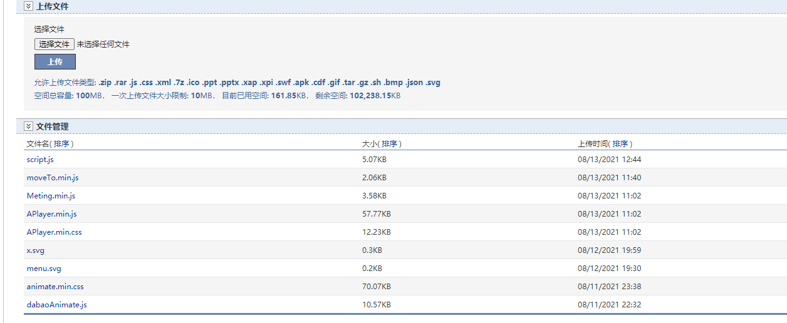

<!--
 * @Descripttion: 
 * @version: 
 * @Author: 松岛川树
 * @Date: 2021-08-13 16:23:21
 * @LastEditors: 松岛川树
 * @LastEditTime: 2021-10-22 21:52:27
 * @FilePath: \cnblogs-pink\docs\guide\start.md
-->

# 项目目录

1. 拉取项目后打开文件夹将css,svg,js文件上传到博客园文件里
  

2. 博客皮肤设置为Custom
3. 打开 <a href="https://github.com/songdaochuanshu/cnblogs-pink/blob/55d2ee7b7caca049214a33ffbf3fd1aefebb170b/css/cnblogs-pink.css">cnblogs-pink.css</a> 将样式复制到页面定制css代码里,禁用模板默认css
4. 复制sidebar.html内容到博客侧边栏公告
   ```js
   <div class="sideSideBar"></div>
    <h3 class="catListTitle">
    个人信息
    </h3>
    <div id="u_msg">
    <div>
        
    </div>
    <div>
        <p>松岛川树</p>
        <p>许多人来来去去相聚又别离</p>
    </div>
    </div>
    <h3 class="catListTitle">
    友情链接
    </h3>
    <div id="u_msg">
    <a href="https://www.cnblogs.com/songdaochuanshu/articles/links.html">友情链接</a>
    </div>

    <h3 class="catListTitle">
    访问量
    </h3>
    <div id="u_msg">
    本站总访问量<span id="busuanzi_value_site_pv"></span>
    本站访客数<span id="busuanzi_value_site_uv"></span>
    本文总阅读量<span id="busuanzi_value_page_pv"></span>
    </div>

   ```
5. 复制header.html内容到页首HTML代码

```js
   <link rel="stylesheet" href="https://blog-static.cnblogs.com/files/blogs/694881/animate.min.css" />
    <link rel="stylesheet" href="https://blog-static.cnblogs.com/files/blogs/694881/APlayer.min.css" />
    <!-- <link rel="stylesheet" href="https://2x819153o2.imdo.co/cnblogs-pink.css" /> -->

    <div id="menu"></div>
    <!-- loading动画 -->
    <div id="loading">
    <div class="loader">
        <div class="loading">
        <i></i>
        <i></i>
        <i></i>
        </div>
    </div>
    </div>
    <!-- 音乐播放器标签 -->
    <meting-js server="netease" type="playlist" fixed="true" mini="true" order="random" id="6792682878">
    </meting-js>

    <script src="https://unpkg.com/axios/dist/axios.min.js"></script>
    <script src="https://blog-static.cnblogs.com/files/blogs/694881/dabaoAnimate.js"></script>
    <script src="https://blog-static.cnblogs.com/files/blogs/694881/APlayer.min.js"></script>
    <script src="https://blog-static.cnblogs.com/files/blogs/694881/Meting.min.js"></script>
    <script src="https://blog-static.cnblogs.com/files/blogs/694881/moveTo.min.js"></script>
    <script src="https://blog-static.cnblogs.com/files/blogs/694881/cnblogs-pink.js"></script>
    <script src="https://blog-static.cnblogs.com/files/blogs/694881/getLinks.js"></script>
    <script src="https://blog-static.cnblogs.com/files/blogs/694881/snows.js"></script>
    <script src="https://blog-static.cnblogs.com/files/blogs/694881/clipboard.min.js"></script>
    <script src="https://blog-static.cnblogs.com/files/blogs/694881/cp.js"></script>


    <!-- 网站favicon -->
    <script>
    let favicon =  document.getElementById("favicon").href = "https://blog-static.cnblogs.com/files/blogs/694881/favicon.ico";
    </script>
```

6. footer.html内容到页首HTML代码

```js
<div class="fish"></div>
 <script async src="//busuanzi.ibruce.info/busuanzi/2.3/busuanzi.pure.mini.js"></script>
<script src="https://cdn.jsdelivr.net/npm/darkmode-js@1.5.7/lib/darkmode-js.min.js"></script>
<script src="https://blog-static.cnblogs.com/files/blogs/694881/fish.js"></script>
<script>
  console.log = () => {};
  $('.fish').attr('id', 'jsi-flying-fish-container');
  if (location.pathname.match(/\/test_1/)) {
    $("#loading").remove();
    $("#jsi-flying-fish-container").hide();
}
</script>
```
千万要记得把文件链接改成自己链接!!! 


 ok!🙃以上搞完之后就可以保存查看效果了 
 求求给个一键三连叭!虽然很烂!! (口误Star )

